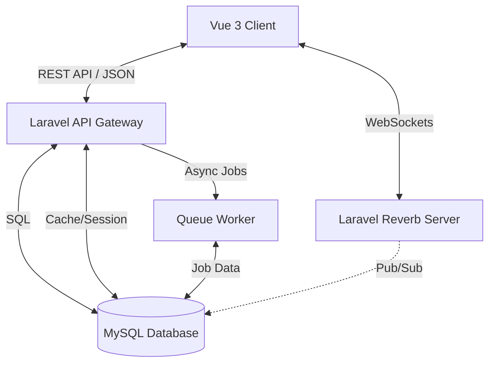

# Project Documentation: Collaborative Project Management System

## 1. Project Overview

### Problem Statement
Organizations struggle with fragmented workflows, disconnected communication, and lack of real-time visibility into project progress. Existing solutions are either too simple (lacking hierarchy) or too complex (steep learning curve), often failing to support cross-departmental collaboration effectively.

### Solution
A **full-stack, real-time Project Management System** designed to bridge the gap between simple task lists and enterprise resource planning. It features a hierarchical task structure (Projects > Lists > Tasks > Subtasks), robust department-based access control with cross-department sharing, and a responsive "ClickUp-style" interface that updates instantly across all connected clients.

### Target Users
*   **System Owners (Admins)**: Full oversight of all departments and system settings.
*   **Project Managers (Heads)**: Manage specific departments or projects, assign resources, and track timelines.
*   **Team Members**: Execute tasks, collaborate via comments, and track time.
*   **Collaborators (Guests)**: Restricted access to specific projects or tasks for external partners.

---

## 2. Feature Breakdown

### User Roles & Permissions
The system implements a hybrid **RBAC (Role-Based Access Control)** and **ACL (Access Control List)** model:

*   **Owner**: Super-admin with `*:*` permissions.
*   **Project Manager**: Can manage projects within their Department + projects they own.
*   **Team Member**: Standard access; can view assigned projects and edit assigned tasks.
*   **Collaborator**: Highly restricted; can only view/comment on explicitly shared items.
*   **External Viewer**: Read-only access via public share links (token-based).

### Core Workflows
1.  **Department Management**: logical grouping of users and projects.
2.  **Project Lifecycle**: Creation -> Task Planning -> Execution (Kanban/List) -> Completion.
3.  **Task Management**:
    *   **Recursive Subtasks**: Unlimited nesting depth (Tasks within Tasks).
    *   **Kanban Board**: Drag-and-drop status updates.
    *   **Dependencies**: Blocking/Blocked-by relationships.
4.  **Real-Time Collaboration**:
    *   Live typing indicators and comments.
    *   Instant status updates (no page refresh).
    *   In-app specific notifications.

---

## 3. System Architecture

The project follows a modern **Monolithic API** backend with a **SPA (Single Page Application)** frontend, decoupled via REST API and WebSockets.

### Tech Stack
*   **Frontend**: Vue 3 (Composition API), Vite, TypeScript, TailwindCSS v4, Pinia (Store).
*   **Backend**: Laravel 12 (PHP 8.2+), MySQL 8.
*   **Real-Time**: Laravel Reverb (WebSocket Server), Laravel Echo (Client).
*   **Authentication**: JWT (JSON Web Tokens) via `tymon/jwt-auth`.

### High-Level Diagram

---

## 4. Database Design

### Core Schema (Key Tables)

#### Identity & access
*   `users`: Stores credentials, global role ([owner](file:///c:/Users/mhdni/OneDrive/Desktop/project-management-tool/backend/app/Models/Project.php#35-39), `project_manager`, `team_member`), and `department_id`.
*   `departments`: Organizational units.
*   `project_user`: Pivot table for project membership with local roles (`head`, [member](file:///c:/Users/mhdni/OneDrive/Desktop/project-management-tool/backend/app/Models/Project.php#40-46)).

#### Work Management
*   `projects`: The root container. Owned by a User, belongs to a Department.
*   `task_lists`: Container for tasks (e.g., "Backlog", "Sprint 1") - *allows multiple lists per project*.
*   [tasks](file:///c:/Users/mhdni/OneDrive/Desktop/project-management-tool/backend/app/Models/Project.php#52-56): The core entity.
    *   **Self-Referential**: `parent_id` allows infinite nesting (Subtasks).
    *   **Kanban Support**: `status` + [position](file:///c:/Users/mhdni/OneDrive/Desktop/project-management-tool/backend/app/Http/Controllers/Api/TaskController.php#1374-1395) columns.
    *   **Polymorphic Features**: Supports attachments, comments, and activities.
*   `task_dependencies`: `task_id` -> `depends_on_task_id` (Many-to-Many).

#### System & Infrastructure
*   `cache`: Stores application cache and session data (replacing Redis).
*   `jobs`: Stores queued tasks (replacing Redis) for asynchronous processing.
*   `job_batches`: Manages grouped background jobs.

#### Social & Notification
*   [comments](file:///c:/Users/mhdni/OneDrive/Desktop/project-management-tool/backend/app/Models/Task.php#121-125): Polymorphic or direct link to tasks.
*   [notifications](file:///c:/Users/mhdni/OneDrive/Desktop/project-management-tool/backend/app/Models/User.php#101-105): Stores in-app alerts.
*   `notification_preferences`: Fine-grained user control over alert types.

#### Indexing Strategy
*   **Composite Indexes**: [(project_id, status)](file:///c:/Users/mhdni/OneDrive/Desktop/project-management-tool/backend/app/Http/Controllers/Api/TaskController.php#289-368) and [(task_list_id, position)](file:///c:/Users/mhdni/OneDrive/Desktop/project-management-tool/backend/app/Http/Controllers/Api/TaskController.php#289-368) for fast Kanban rendering.
*   **Full-Text Search**: On `tasks.title` and `tasks.description`.
*   **Foreign Keys**: Strict constraint enforcement with `ON DELETE CASCADE` for data integrity (e.g., deleting a Project deletes all Tasks).

---

## 5. Backend Flow

### API Architecture
The backend is structured as a Resource-Oriented API:
*   **Controllers**: Light controllers that delegate to Services or Models.
*   **Form Requests**: Strict validation logic (e.g., `CreateTaskRequest`).
*   **Policies**: Granular authorization gates (e.g., `TaskPolicy::update` checks if user is owner OR assigned).
*   **JsonResources**: API Response transformation (filtering confidential data).

### Key Components
*   **[TaskController](file:///c:/Users/mhdni/OneDrive/Desktop/project-management-tool/backend/app/Http/Controllers/Api/TaskController.php#20-1454)**:
    *   Handles recursive loading of subtasks (`with('allSubtasks')`).
    *   Manages Kanban reordering logic (updating [position](file:///c:/Users/mhdni/OneDrive/Desktop/project-management-tool/backend/app/Http/Controllers/Api/TaskController.php#1374-1395) values for affected siblings).
*   **[TeamDashboardController](file:///c:/Users/mhdni/OneDrive/Desktop/project-management-tool/backend/app/Http/Controllers/Api/TeamDashboardController.php#14-620)**:
    *   Aggregates metrics (Completion Rate, Overdue Count) via raw SQL/aggregates for performance.
*   **`ActivityLog`**:
    *   Observer/Service that records *every* meaningful change (Status change, Assignment) for audit trails.

### Real-Time Events
Laravel Events implements the `ShouldBroadcast` interface:
*   `TaskUpdated`: Broadcasts to `project.{id}` channel.
*   `TaskCreated`: Broadcasts to `project.{id}` channel.
*   Payloads are optimized (IDs only or partial objects) to reduce WebSocket overhead.

---

## 6. Frontend Flow

### Architecture (Vue 3 + Pinia)
*   **Services Layer**: `api/*.ts` files handle Axios calls.
*   **Store Layer (Pinia)**:
    *   `useTaskStore`: Manages the Kanban state `tasksByStatus`. Implements **Optimistic Updates** (updates UI immediately, reverts on API failure).
    *   `useUserStore`: Caches user lists to prevent redundant calls.
*   **Components**:
    *   Atomic design (Buttons, Inputs).
    *   Smart Components (`KanbanBoard`, `TaskDetailModal`) that interact with Stores.

### State Management Strategy
1.  **Fetch**: Component mounts -> Calls Store Action -> Calls API -> Updates State.
2.  **Update**: User Interaction -> Store Optimistic Update -> API Call.
3.  **Real-Time**: Echo Listener (`.listen('TaskUpdated')`) -> Store Mutation -> UI Refresh.

---

## 7. Real-Real-Time & Notification System

### The "Live" Experience
*   **WebSocket Channels**:
    *   `private-user.{id}`: Personal notifications.
    *   `presence-project.{id}`: Who is viewing the project (typing indicators).
*   **Notification Logic**:
    *   A synchronous Listener queues a `SendNotification` job.
    *   Job checks `NotificationPreferences` (Email vs In-App).
    *   Delivers payload.

### Edge Cases Handled
*   **Race Conditions**: Handled by database locking/atomic updates where critical.
*   **Reconnection**: Client auto-reconnects to WebSocket; State re-fetches (can be improved with versioning) to ensure consistency.

---

## 8. Performance Optimizations

1.  **Eager Loading**: Backend uses `with(['assignees', 'subtasks', 'comments'])` to prevent N+1 queries.
    *   *Special optimization*: `Task::loadBroadcastData()` loads a lighter dataset for WebSocket events than full REST responses.
2.  **Frontend Caching**: `useUserStore` checks `if (hasFetchedUsers)` before hitting the API.
3.  **Client-Side Filtering**: Sorting and searching are done on the client for small datasets (Project Tasks) to provide instant feedback.
4.  **Debouncing**: Search inputs and "Saving..." indicators are debounced (300ms) to reduce API load.

---

## 9. Security Considerations

1.  **Authentication**:
    *   Stateless JWT (Access Token + Refresh Token flow).
    *   Tokens stored in `localStorage` (Note: `HttpOnly` cookie recommended for higher security).
2.  **Authorization**:
    *   **Middleware**: `role:owner`, `jwt.auth`.
    *   **Policies**: Model-level checks (e.g., `User::canViewProject`). Handles complex logic like "User can see project IF in same department OR explicitly assigned".
3.  **Input Sanitation**: Use of Laravel Eloquent prevents SQL Injection. XSS protection via Vue's escaping.

---

## 10. Scalability & Maintainability

### Scalability
*   **Horizontal**: API is stateless; can run on multiple servers behind a load balancer.
*   **Database**: Read replicas can be added. MySQL handles caching/session (via `cache` table).
*   **Queueing**: Heavy tasks (Emails, Reports) are offloaded to background workers via the `jobs` table.

### Maintainability
*   **Strict Typing**: Frontend uses TypeScript interfaces ([Task](file:///c:/Users/mhdni/OneDrive/Desktop/project-management-tool/backend/app/Models/Task.php#9-444), [User](file:///c:/Users/mhdni/OneDrive/Desktop/project-management-tool/backend/app/Models/User.php#11-299)).
*   **Code Reusability**:
    *   Backend Traits (`HasPermissions`).
    *   Frontend Composables (`useModal`, `useToast`).
*   **Documentation**: API endpoints are self-documented via sensible naming conventions in [routes/api.php](file:///c:/Users/mhdni/OneDrive/Desktop/project-management-tool/backend/routes/api.php).

---

## 11. Typical User Journeys

### Journey 1: The Project Manager Planning a Sprint
1.  **PM logs in** -> Redirected to `DepartmentDashboard`.
2.  **Creates Project**: "Q4 Website Redesign".
3.  **Adds Members**: Selects users from Department + 1 External Designer.
4.  **Bulk Creates Tasks**: Uses "Quick Add" in List View.
    *   *System* auto-assigns [position](file:///c:/Users/mhdni/OneDrive/Desktop/project-management-tool/backend/app/Http/Controllers/Api/TaskController.php#1374-1395) for ordering.
5.  **Reorders**: Drags tasks to prioritize.
    *   *System* sends batch update for positions.

### Journey 2: The Developer Working on a Task
1.  **Dev logs in** -> Sees `MyTasksView` (Filtered by `assigned_to = me`).
2.  **Opens Task**: Checks "Integrate Payment Gateway".
3.  **Changes Status**: Moves from "Not Started" to "In Progress".
    *   *Optimistic UI* moves card instantly.
    *   *WebSocket* notifies PM immediately.
4.  **Adds Comment**: "API keys are missing."
    *   *Notification* sent to Project Owner.

### Journey 3: The Stakeholder Review
1.  **Stakeholder receives link**: Public Share Link.
2.  **Access**: Enters password (if protected) or Token validates.
3.  **View**: Sees Read-Only Kanban Board.
4.  **Updates**: Page auto-updates as team makes changes (via Public Channel WebSockets).
